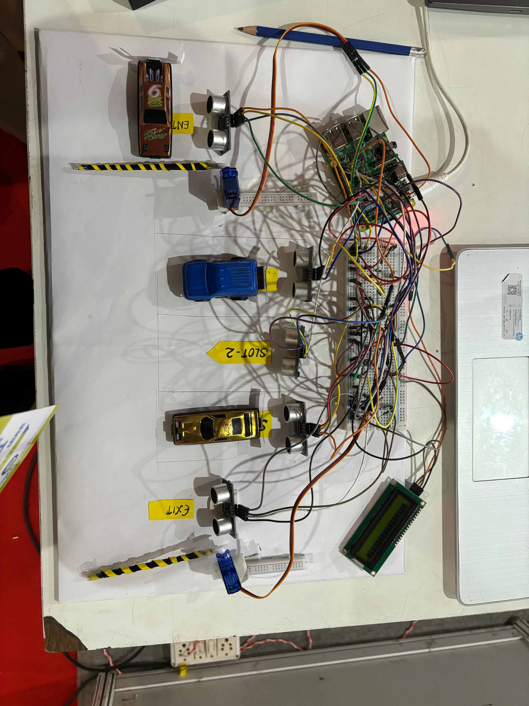

# 🚗 **Smart Parking System with License Plate Recognition**


---



---

## **Repository Structure**

```
Smart_Parking_System_LPR/
├── parking_system.py             # Core parking logic: barriers, sensors, LCD
├── license_plate_recognition.py  # License Plate Recognition with OpenCV & OCR APIs
├── README.md                     # Project documentation
```

---

## **Project Overview**

This is an **IoT-based Automated Smart Parking System** using a **Raspberry Pi**, combining:

* **Vehicle Detection:** Ultrasonic sensors for entry, exit & slots.
* **Barrier Automation:** Servo motors for gate control.
* **Live Display:** Real-time slot info & fee on an I2C LCD.
* **LPR Module:** License Plate Recognition using **OpenCV**, **pytesseract**, and the **OCR.Space API**.

---

## **Features**

Automated vehicle entry & exit detection
Barrier control with servos
Real-time available slot count
Parking fee calculation based on stay duration
Camera feed for plate capture
Dual OCR methods: Local (`pytesseract`) & Cloud (`OCR.Space`)

---

## **Requirements**

** Hardware:**

* Raspberry Pi (GPIO support)
* Ultrasonic sensors (HC-SR04)
* Servo motors (entry & exit barriers)
* I2C 16x2 LCD Display
* Camera (USB or IP, e.g., DroidCam)

** Software:**

* Python 3.x
* `opencv-python`
* `pytesseract`
* `smbus2`
* `RPLCD`
* `requests`
* `Pillow (PIL)`

---

## **How It Works**

*  **Entry:** Vehicle detected → barrier opens → parking time logged → slot count updates.
*  **Exit:** Vehicle detected → fee calculated → barrier opens → slot freed.
*  **Display:** LCD shows slots left & fee.
*  **LPR:** Camera captures frames, extracts text with OCR, prints plate numbers.

---
